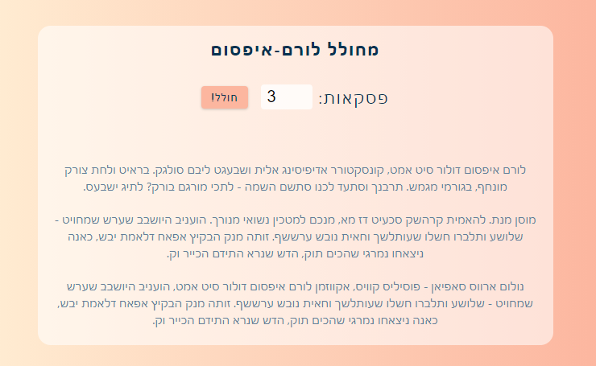

<h1 align="center">Lorem-Ipsum-Generator-Hebrew</h1>

## Project Description

React Project to create a Lorem Ipsum generator in hebrew including input validations to show maximum 50 P

## Built with

- HTML
- CSS
- React

# npm-start

[npm start](https://docs.npmjs.com/cli/v7/commands/npm-start)

```
npm install
npm install react-icons --save
```

```
npm-start -g

```

## Links

- [Repo](https://github.com/AlmogWer/lorem-ipsum-generator-hebrew "Tabs Repo")
- [Live](https://almogwer-lorem-ipsum-generator.netlify.app/ "Live View")

## Screenshots



## Author

- [Almogwer](https://github.com/almogwer)
- [Mail](mailto:Almogish@gmail.com?Subject=Hi% "Hi!")
- [Linkedin](https://www.linkedin.com/in/almogwertzberger/)
